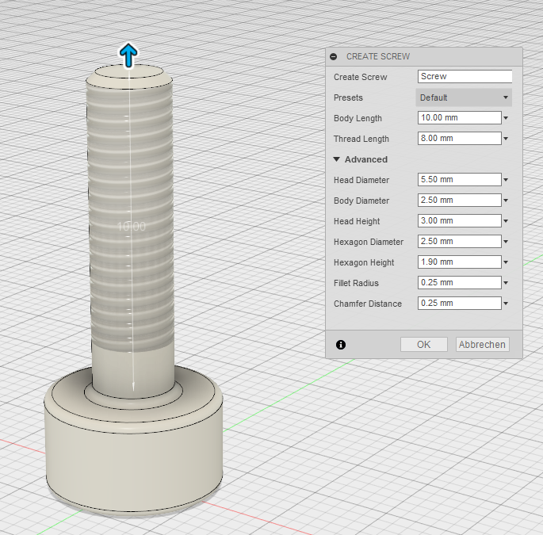

# CustomScrews  

Fusion 360 App which creates custom screws by different parameters.  

### Installation

* Download the project as zip file and extract it to `C:\Users\YOURNAME\AppData\Roaming\Autodesk\Autodesk Fusion 360\API\AddIns`
* (Instead of downloading the zip, you could also fork this project directly into the given folder)
* Open Fusion 360 and then click on 'Scripts and Add-Ins'
* Go to the Add-In tab and open (green plus) existing projects and select the `CustomScrews` folder
* Start your new script and I hope you are happy with it.

### Requirements

Install the requirements into the `./modules` folder.

``` 
pip install -r requirements.txt -t ./modules/
```

### Deinstallation

* Stop the Add-In in Fusion 360
* Delete the extracted files in the previous given folder

### Parameters

The following technical drawing is showing the changeable parameters of the screw. 
  
  
__Screw Name:__ Name of the Body  
__Head Diameter:__ Diameter of the cylinder head  
__Body Diameter:__ Diameter of the body shaft  
__Head Height:__ Height of the cylinder head  
__Body Length:__ length of the body shaft  
__Hexagon Diameter:__ Diameter of the inner Circle of the hexagonal polygon  
__Hexagon Height:__ Height to cut the hexagon from the cylinder head  
__Fillet Radius:__ Radius of all fillets  
__Thread Length:__ length of the thread  
__Chamfer Distance:__ distance of the 45degree chamfer on the body shaft  

### Screenshots



### Future Features

* auto-placement of a kind of screws to selectable joint origins
* verification of depending parameters
